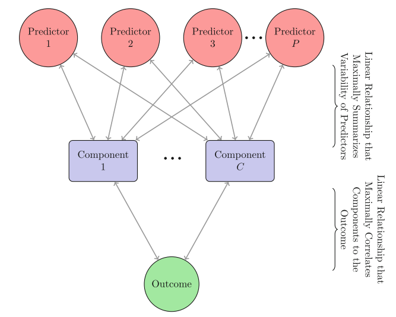

## Chapter 5: Measuring Performance in Regression Models
__Quantitative Measures of Performance__
* __Root Mean Square Error (RMSE)__: Most common method for model performance when outcome is a number
  * Observed values minus model predictions
* __Mean Squared Error (MSE)__: square the residuals, sum them and divide by the number of samples
  * Takng square root of MSE will give RMSE
* __Coefficient of determination (</a>)__: proportion of info in data that is explained by model
  * However, this is a measure of correlation not accuracy (e.g. may over predict low values and underpredict higher ones)
  * examples of different correlations:
  </a>
* __Rank Correlation__: take ranks of observed outcome values (as opposed to their actual numbers) and evaluate how close they are to ranks of the model prediction
  * __Spearman's Rank Correlation__: correlation coefficient calculated between ranks of observed and predicted outcomes
  
__Variance-Bias Trade Off__
* MSE of a model:

* </a> is the outcome and </a> is the model prediction of that sample's outcome
* If it is assumed data points are statistically independent and residuals have theoretical mean of zero and constant variance:

</a>

* Where *E* is the expected value
* __Irreducible Noise (</a>)__: cannot be eliminated by modeling
* __Model Bias__: how close functional form of model can get to the true relationship between predictors and outcome
* __Variance-Bias Trade-Off__: increasing model bias will decrease model variance
  * High variance can lead to over-fitting
  * low bias = high "accuracy"; high bias = low accuracy  
  * Great post on this issue: http://scott.fortmann-roe.com/docs/BiasVariance.html
## Chapter 6: Linear Regression and Its Cousins
* Linear models seek to find estimates of the parameters so that the sum of squared errors is minimized
* Linear models tend to have high interpretability, however if the relationship between predictors and response do not fall on a straight line then the model may not be suitable
* Solutions to the regression problem include adequate *preprocessing* of the predictors e.g. by data reduction or by *regularization* of the regression model using penalty terms

__Linear Regression__
* Objective is to find plane that minimizes the __sum-of-squared errors (SSE)__ between observed and predicted response: 

</a>

* The optimal plane is:

</a>

* __X__ is the matrix of predictors and __*y*__ is the response vector

__Partial Least Squares__
* If correlation amoung predictors is high, then ordinary least squares solution will have high variability (unstable)
* Further, when the number of predictors is greater than the number of observations PCA can be used
  * The new predictors (from the PCA) are linear combinations of original predictors, this makes interpretation more difficult

* __Principal component regression (PCR)__: pre-process predictors using PCA then perform a regression
  * However, if variability in predictor space is not related to response variability then PCR will under perform
* __PLS__ finds components that simultaneously summarize variation of the predictors while being optimally correlated with the outcome
  * PLS is *supervised* while PCR is *unsupervised*
* Number of components to retain is the only PLS tuning parameter
  * Resampling techniques can be used to determine this parameter

__Penalized Models__
* penalized models are essentially just another way to combat the problem of multicollinearity of predictors but instead by means of __regularization__ of the beta coefficients rather than __data reduction__; two common techniques are __L1 (Lasso)__ and __L2 (ridge regression)__ regularization
  1. L1 regularization = "lasso" (some predictors are completely eliminated)
  2. L2 regularization = "ridge regression" (all predictors are still used; but weights are changed)
* __Ridge Regression__:
  * technique for analyzing multiple regression data in the presence of multicollinearity of predictors
  * the problem with multicollinearity: least squares estimates are unbiased; but variances are large and thus can be unstable
  * by adding bias to the regression estimates, ridge regression can reduce the variance --> hopefully more reliable estimates
  * when regression parameter estimates are inflated, add penalty to control magnitude

</a>

* Paramter estimates are only allowed to become large if there is a proportional reduction in SSE
  * Termed __*Shrinkage Method*__: shrinks the estimates toward 0 as the lambda penalty becomes large
  * Lambda is the tuning parameter??
  * nice summary: https://ncss-wpengine.netdna-ssl.com/wp-content/themes/ncss/pdf/Procedures/NCSS/Ridge_Regression.pdf
  * another link: https://web.as.uky.edu/statistics/users/pbreheny/764-F11/notes/9-1.pdf
* __Least Absolute Shrinkage and Selection Operator (Lasso)__: similar to ridge regression excpet it penalizes the abolute parameter estimate values

</a>

* Regression coefficients are still shrunk towards 0, some parameters are actually set to 0 for some value of lambda
* __Elastic Net__: combination of both lasso and ridge penalties:

</a>
