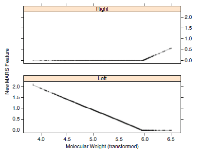
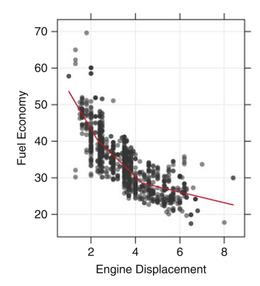
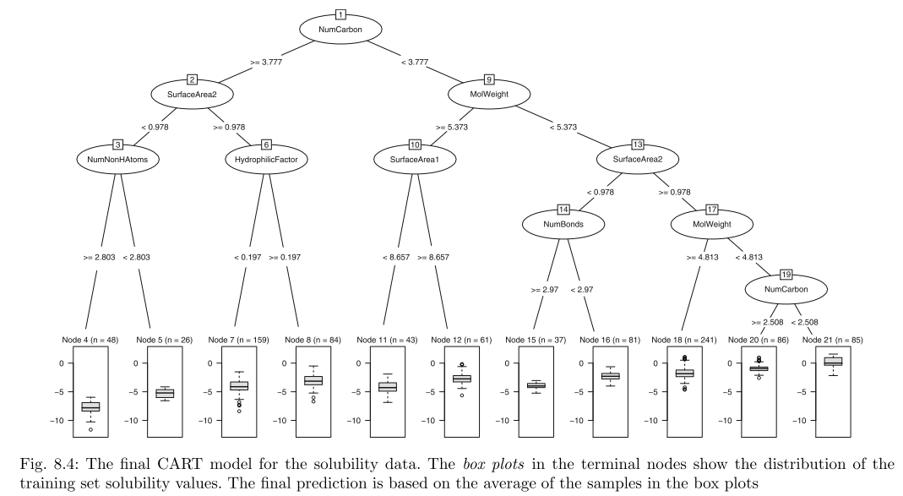
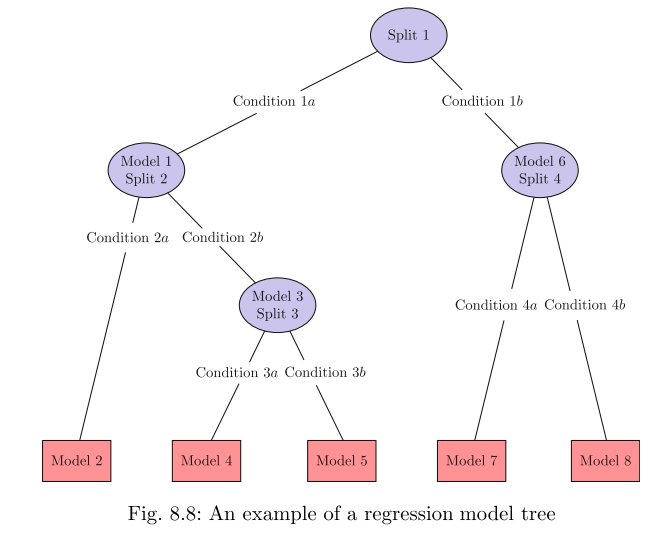
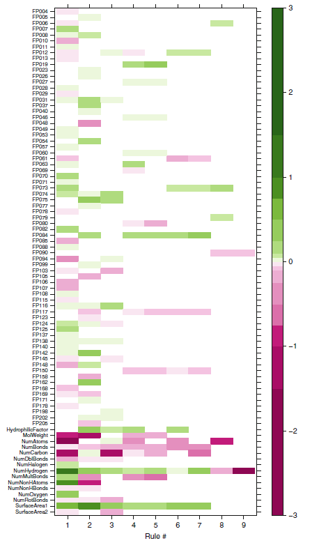
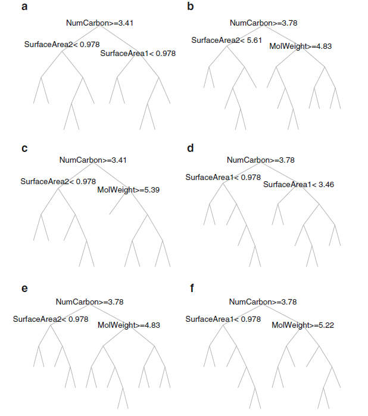

## Chapter 7: Nonlinear Regression Models
* Linear regression models can be adpated to nonlinear trends by adding model terms (e.g. squared terms)
  * However, you need to know the specific nature of the nonlinearity in the data
* There are regression models that are inherently nonlinear and therefore you do not need to know the exact form of nonlinearity 
* several nonlinear models covered: neural networks, multivariate adaptive regression splines (MARS), support vector machines (SVMs), K-nearest neighbors (KNN)
* Note: tree-based models covered as a separate chapter

### Neural Networks
* __Hidden Variables__: intermediate unobserved variables used to model outcome
  * Linear combinations of original predictors, not estimated in hierarchical fashion
* Linear combination usually transformed by nonlinear function (e.g. sigmoidal function):
<p align="center"></a>
<p align="center"></a>

* The </a> coefficients similar to regression coefficients
* Coefficient </a> is the effect of the *j*th predictor on the *k*th hidden unit
* No constraints that help define linear combinations, thus there is little likelihood that coefficients in each unit represent some coherent peice of info
* Linear combination that connects hidden units to outcome is:
<p align="center"></a>

* Neural networks have tendency to over-fit relationship between predictors and the response (large number of regression coefficients)
* To combat this issue several apporaches proposed:
  1. **Early stopping**: stop optimization process when some estimate of error rate starts to increase
  2. **Weight decay**: penalization method to regularize the somdel similar to ridge regression (penalty for large regression coefficients, any large value must have significant effect on model erros to be tolerated)
  
### Multivariate Adaptive Regression Splines (MARS)
* MARS used surggotate features instead of original predictors (like neural networks and PLS)
* MARS does not use linear combinations of predictors, instead it creates two contrasted versions of predictor 
* New features are "Hinge" functions of the original
* Predictor cut point determined by creating linear regression model with candidate features, model error calculated
  * Predictor/cut point combo that acheives smallest error is used for model
* After model is created with two features, model conducts another search to find next set of features that, given initital set, yield the best model fit
  * Continues until stopping point is reached (set by the user)
* Mathematically, the hinge function is:
<p align="center">0\\&space;0&space;&&space;x&space;\leq&space;0\end{matrix}\right."</a>

[](figures/fig7.2.png) [](figures/Fig02.05a.png)

### Support Vector Machines (SVMs)
* SVMs, for regression, use similar function to Huber.
* User sets threshold limit: data points with residuls within the threshold **DO NOT** contribute to regression fit while data points with an absolute difference greater than threshold **DO** constribute
* Several consequences to using this apporach:
  1. Squared residulas are not used thus large outliers have limited effect on regression
  2. Samples that the model fits well (small residuals) have no effect on the regression
* The poorly predicted points define the line
* SVM linear prediction function:
</a>
* As many alpha paramters as there are datapoints, would normally be over-parameterized, but use of cost value effectively regularizes the model 
* Many different kernels can be used with SVM:
  1. Linear                = </a>
  2. Polynomial            = </a>
  3. Radial basis function = </a>
  4. Hyperbolic tangent    = </a>

* Cost parameter main tool for adjusting complexity of model
  * When cost is large: model is flexible since effect of errors is amplified
  * When cost is small: model "stiffens" and less likely to over-fit because contribution of squared parameters is proportionally large in modified error function
* Could also tune model over size of funnel, </a>. In Kuhn's experience, cost parameter provides more flexibility for tuning model
  * Thus, fix a value for </a> and tuning over the other kernel parameters

### K-Nearest Neighbors (KNN)
* Predicts new sample suing *K*-closest samples from training set
* Construction is based on individual samples from training data
  * *K*NN identifies new samples *K*NNs in predictor space, the predicted response for new sample is mean of *K* neighbors' response
  * Median can also be used
* Euclidean distance commonly used to define distance between samples:
<p align="center"></a>

<p align="center">where </a> and </a> are two individual samples</a>

* Scale of predictors can have dramatic influence on distances amoung samples (since *K*NN method depends on distance between samples)
  * Predictros with largest scales will contribute most to distance between samples
  * Center and scale all predictors
* Determing number of neighbors, *K*, can be determined by resampling
  * Plotting RMSE for each value of *K* will indicate how many to use
* Computation time is a disadvantage as distance of new sample from all training samples must be computed
  * To overcome this use *k*-dimensional tree (*k*-d tree), which orthogannly partitions predictor space using tree apporach 
  * Distances are only calculated for those training observations in the tree that are close to the new sample
  
## Chapter 8: Regression Trees and Rule-Based Models
* Tree-based models consist of 1+ nested if-then statements for the predictors that partition the data
* Advantages:
  * highly interpretable + easy to implement
  * effectively handle many types of predictors without need for preprocessing
  * effectively handle missing data
  * JL: fast?
* Disadvantages:
  * model instability (slight changes in data --> drastic changes in tree structure + thus interpretability
  * less-than-optimal predictive performance
* Solution to performance issues: __Ensemble methods__ (combining multiple tree-based/rule-based models into one)

### Basic Regression Trees
* Classification and regression tree (CART) is most utilized
  * Begins with entire dataset, *S*, searches every value of every predictor to find the predictor and split value that partitions data into two groups (</a> and </a>) such that overall SSE is minimized
<p align="center"></a>

* Continuous or binary predictors make finding optimal split point straightforward
* When predictor has more than two categories, the process of finding optimal split point can take a couple of paths
* When tree growing step is completed you may have to prune it back so it does not over-fit
* Pruning is done by penalizing the error rate using the size of the tree:
<p align="center"></a>
<p align="center">where </a> is called complexity parameter</a>
* For specific value of complexity parameter we find the smallest pruned tree that has lowest penalized error rate



### Regression Model Trees
* simple regression trees tend to underpredict samples at extremes (since terminal nodes use the average of the training set outcomes for prediction)
* the solution employed in regression model trees: use a different estimator in the terminal nodes
* one implementation: the __model tree approach__ called __M5__ (Quinlan, 1992) and implemented in the `Weka` software package
* how are they different from simple regression trees:
  1. splitting criterion is different
  2. terminal nodes predict the outcome using a *linear model* (as opposed to a simple average)
  3. when a sample is predicted, often a combination of predictions from different models along the same path through the tree



### Rule-Based Models
* A rule is a distinct path through a tree
* **Coverage**: the number of samples affected by a rule
* If you want to use a tree approach and simplify it into one decision path --> use a rule-based model (as it is a single pathway down the tree; Note: may not include all the predictors)
* Fig. 8.13. Linear model coefficients for the rule-based version of M5 demonstrating which variables are contributing to each path down the tree; and how certain rules contribute more to the data then others:


### Bagged Trees
* *B*ootstrap *agg*regation (Bagged) uses bootstrapping in conjunction with any regression ( or classification) model to construct an ensemble
* Each model in the ensemble used to generate a prediction for new sample and these *m* predictions are averaged to give bagged model's prediction
* Bagging reduces variance of a prediction through its aggregation process
  * When predictions for sample are averaged across all the single trees, the average prediction has lower variance than the variance across the individual predictions



### Random Forests
* From a statistical perspective, reducing correlation among predictors can be done by adding randomness to the tree construction process.
* Unified algorithm called __random forests__ by essentially adding randomization to the original bagging algorithm (Breiman, 2001)
* tuning parameter: # of randomly selected predictors, k, to choose from which to split (Breiman recommends setting this value k to be 1/3 of the number of predictors)
* Basic random forests algorithm:
```
1. Select the number of models to build, m
2. for i =1 to m do
  3. Generate a bootstrap sample of the original data
  4. Train a tree model on this sample
    5. for each split do
      6. Randomly select k (<P) of the original predictors
      7. Select the best predictor among the k predictors and partition the data
    8. end
9. Use typical tree model stopping criteria to determine when a tree is complete (but do not prune)
10. end
```
* the ensemble nature of random forests makes it impossible to gain an understanding of the relationship between the predictors and the response

### Boosting
* []

### Cubist
* []
