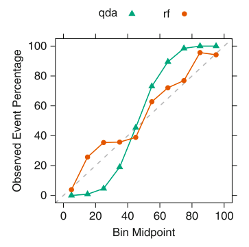
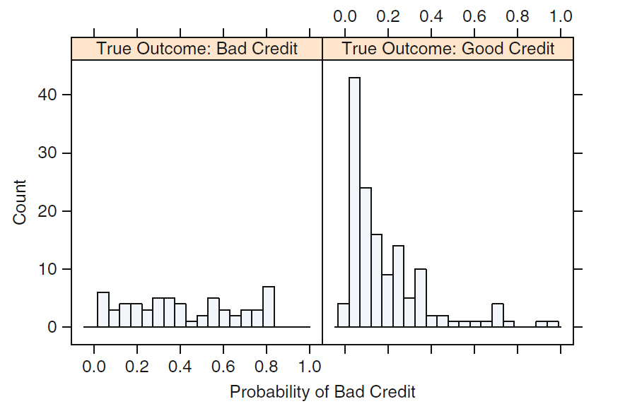
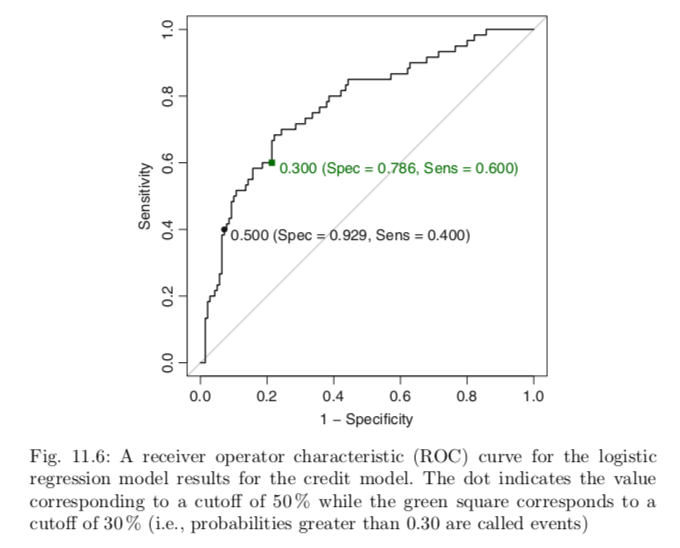

# Part III: Classification Models

## Chapter 11: Measuring Performance in Classification Models

### 11.1 Class Predictions
* Classification models generate two types of predictions: *probability estimates* (continuous value) and a *predicted class* (discrete value/category)
* Probability estimates give you an idea of the model's confidence about predicted classification

#### Well-Calibrated Probabilities
* Predicted class probability needs to be well-calibrated (must reflect true likelihood of event of interest)
* Calibration plot will visually depict the observed probability of event vs. the predicted class probability

[comment]: # (I believe the code here is just an example rather than some interesting equation we should know)
* True probability of event is generated by(classes 1 and 2, predictors A and B):

</a>

#### Presenting Class Probabilities
* Using a histogram for a few classes is a good way to represent class probability

* When there are three or more classes using a heat map can be helpful

   

#### Equivocal Zones
* Intermediate zone where the class is not formally predicted when the confidence is not high
    * defined as 0.05 +/- *z* (if z=.10, probabilites between 0.40 and 0.60 would be equivocal
* defining this zone can improve classification performance

### 11.2 Evaluating Predicted Classes
* __Confusion matrix__ is a cross-tabulation of observed and predicted classes for the data (in other words, a 2x2 table!)
    *  Diagonal cells denote cases where classes are correctly predicted while off-diagonals show number of errors for each case
    * optimists call it "accuracy" rate, while pessimists call it "error" rate

   

* Overall accuracy rate reflects agreement between observed and predicted classes
    * Makes no distinction about type of errors being made
* __No-information rate__ is the accuracy rate that can be acheived without a model (1/number of classes)
    * Does not consider relative frequencies of classes in training set
* A better definition would be the percentage of the largest class in training set
* The __Kappa Statistic__ takes into account the accuracy that would be generated by chance:
  * originally designed to assess the agreement between two raters

</a>

* *O* is observed accuracy and *E* is the expected accuracy based on marginal totals of confusion matrix
* Takes on values between -1 and +1
    * 0 being no agreement between observed and predicted classes
    * 1 is perfect concordance of model prediction and observed classes
    * negative values indicate prediction is in opposite direction of truth
* Kappa value within 0.30 to 0.50 would be reasonable agreement 
    * e.g. Accuracy of model is 90% and expected accuracy is 85%, the kappa statistic would show moderate agreement (Kappa = 1/3)
    * :confounded: *why is 85% used here? we think it might be if classes are unbalanced. If classes are balanced, E would be 1/c, but if not, you could get something like class1 = 15%, and class2 = 85%. (???)
    * [See this thread for extra help](https://stats.stackexchange.com/questions/82162/cohens-kappa-in-plain-english)
* __Weighted Kappa__ can be used if more than two classes with natural ordering to classes (small,medium,large)
   * Higher penalty is applied to errors further away from true result (small predicted as high vs. small predicted as medium)
    
#### Two-Class Problems
* Sensitivity of model is rate that the event of interest is predicted correctly for all samples having that event:

</a>

* Specificity the rate that the nonevent samples are predicted as nonevents

</a>

* __True positive rate__ is the sensitivity as it measures the accuracy in the event population
* __False positive rate__ is defined as 1 minus the specificity
* __Youden's J Index__ provides single measure that reflects false-positive and false-negative rates:

</a>

* Sensitivity and specificity are *conditional measures*, sensitivity being the accuracy rate for only the event population; specificity being the accuracy rate for only the nonevent population
   * For new samples, all that is known is the prediction; this is where PPV and NPV come in
* Unconditional queries ask "What are the chances that the fetus has the genetic disorder?"
* __Positive predicted value__ is the analog to sensitivity and __Negative predicted value__ is the analog to specificity
   * Make unconditional evaluations of the data by asking " What is the probability that this samples is an event?"

</a>

</a>
* typically a trade-off between sensitivity and specificity (assuming a fixed level of accuracy for the model)
  * the receiver operating characteristic (ROC) is one technique for evaluating this trade-off (see Section 11.3)

#### Non-Accuracy-Based Criteria
* accuracy: not always appropriate method, e.g., if the model is fit for a predictive purpose

### 11.3 Evaluating Class Probabilities

#### Receiver-Operator Characteristic (ROC) Curves
* ROC curves determine effective threshold such that values above are indicative of a specific event (given set of continuous data)
* Created by evaluating the class probabilites for the model across continuum of thresholds
   * For each candidate threshold, resulting true-positive rate and the false-positive rate are plotted against eachother
* Advantage is that, since it is function of sensitivity and specificity, the curve is insensitive to disparities in class proportions
* Can also compuate area under the curve (AUC) as a quantitative assessment of the model

#### Lift Charts
* Visualization tool for assessing the ability of a model to detect events in a data set with two classes
   * Rank the samples by their scores and determine the cumulative event rate as more samples are evaluated

   

* :confounded: What is "% Events Found"? We think it's the top row (events) of a confusion matrix: how many events were found that were in fact really events in the data?

## Chapter 12: Discriminant Analysis and Other Linear Classification Models

The introductory paragraph nicely summarizes that there are different techniques used to achieve minimization for classification/discrimination purposes: some take a more mathematical path (e.g. linear discriminant analysis) and others a more algorithmic path (e.g. K-nearest neighbors). This chapter focusses on the mathematically based ones, i.e. LDA, PLSDA, logistic regression, etc.

### 12.2 Logistic Regression
* Maximum likelihood parameter estimation is a technique used when we are willing to make assumptions about probability distribution of the data (e.g.g a normal/Gaussian distribution); recall the mathematical principle is to *minimize the sum of the squared residuals*
* Binomial distribution most often used when there are two classes
   * Has single parameter *p* that is the probability of event or specific class
* Logistic regression has intercept in addition to slope parameters for each model term.  
   * If *p* is the probability of the event, the odds of the event are then *p*/(1-*p*)
* Logistic regression models the log odds of the event as a linear function:

</a>

* *P* is the number of predictors
* Function of event probability:

</a>

### 12.3 Linear Discriminant Analysis
* Minimizing the total probability of misclassification, which depends on class probabilites and multivariate distributions of the predictors
* Bayes' rule:

</a>

* </a> is the __Prior Probability__ of membership in class </a>
   * These values are either known, determined by proportions of samples in each class, or are unknown in which case all values of the priors are set to be equal
* </a> is the __conditional probability__ of observing predictors *X*, given that the data stem from class </a>
   * We assume data generated from probability distribution, which then defines this quantity's mathematical form
* </a> is the __posterior probability__ that the samples, *X*, is a member of class </a>

* Fisher formulated the problem in a different way: find the linear combination of predictors that gives the *maximum* separation between the centers of data while at the same time *minimizing* the variation within each group of data
* Kuhn suggests that practitioners should be rigorous in preprocessing data: recommends centering and scaling data; and that near zero-variance predictors are removed

### 12.4 Partial Least Squares Discriminant Analysis
* If measured predictors are highly correlated or number exceeds samples collected then LDA approach cannot be directly used
* PLS finds latent variables that simultaneously reduce dimension and maximize correlation with a continuous response value
* In classification, PLS is seeking to find optimal group separation while being guided by between-groups information
   * PCA seeks to reduce dimension using the total variation as directed by the overall covariance matrix of the predictors
* If dimension reduction is not necessary and classification os the goal, LDA will always provide lower misclassification rate than PLS
* One tuning parameter: number of latent variables to be retained

### 12.5 Penalized Models
* One may include penalty term for logistic regression model
   * Logistic regression finds parameter values that maximizes the binomial likelihood function
* Add squared penalty function to the log likelihood, and find parameter estimates that maximize:

</a>

### 12.6 Nearest Shrunken Centroids
* Linear classification model that is well suited for high-dimensional problems
* For each class, the centroid of the data is found by taking the average value of each predictor (per class) in the training set
   * Overall centroid is computed using the data from all the classes
* If predictor does not contain much info for particular class, its centroid for that class is likely to be close to overajll centroid
* One apporach to classifying unknown samples would be to find the closest class centroid in the full dimensional space and choose that class for prediction
* If you shrink the class centroids closer to overall centroid, centroids that start off closer to overall centroid move to that location before others
* Shrinkage is the only tuning parameter
* This model works well for problems with large number of predictors since it has built-in feature selection that is controlled by shrinkage tuning parameter
