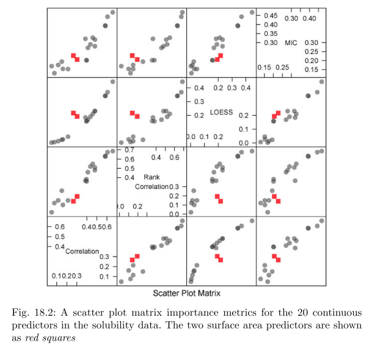
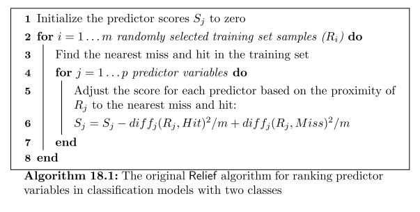
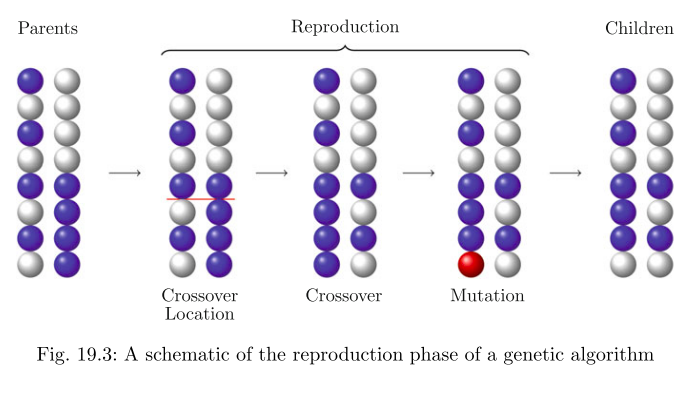

## Chapter 17: Job Scheduling
- High-performance computing (HPC) environments used for large-scale computations
- Consits of numerous 'compute nodes'
- __Job__: specific unit of computations
  * can be launched by users for execution on HPC
- However, large number of programs launched simultaneously and environment has to manage jobs in efficient manner
- __Job Scheduler__: software that prioritizes jobs for submissions, manages computational resources and initiates submitted jobs to maximize efficiency
- Queing baed on:
  * Number processors required and memory requirements
  * project priority
  * current load of environment
  * may also consider submission history of specific user
<p align="center">
     
</p>

- efficiency of scheduler affected by amount and quality of job info that is known at time of submission

# Part IV: Other Considerations

## Chapter 18: Measuring Predictor Importance
Often want to quantify the strength of the relationship between the predictors and outcome:
* to filter which should be used as inputs to the model, i.e. *supervised feature selection*
* JL: also could be a way to sort out which predictors are clinically meaningful or interpretable?
* becomes infeasible when number of attributes is large
- Many models have built-in intrinsic measurements of predictor importance
  * MARS and many tree-based models monitor increase in performance that occurs when adding each predictor to model
- __Variable importance__: relates to quantification of relationship between predictor and outcome

### 18.1 Numeric outcomes

Summary of useful measures (varying from more linear to nonlinear):
1. **sample correlation** statistic (for linear associations)
2. **rank (Spearman)** correlation coefficient (for ~linear or curvilinear associations)
3. **LOESS** (LOcal regrESSion model; uses polynomial regressions in local neighborhoods)
4. **MIC** (maximal information coefficient)

- __Linear__: Correlation statistic used to quantify numeric predictors relationship with outcome
- __Non-linear__: locally weighted regression model (LOESS) uses series of polynomial regressions that model data in small neighborhoods
- these techniques evaluates each predicotr without considering the others, which can be misleading:
  * Some notes: [apparently LOESS is not a true acronym but derived from LOWESS (LOcally WEighted Scatterplot Smoothing)](https://en.wikipedia.org/wiki/Local_regression)
  * pseudo-R2 measures can be computed from the residuals
* if two predictors highly correlated with response and with each other, then univariate approach will identify both as important
    * pre-processing can remove highly correlated predictors
  * univariate approach will fail to identify groups of predictors that together have strong relationship with response
    * e.g. two predictors may not be correlated with the response but their interaction may be
    
* Figure 18.2 is a nice way to look at the performance of predictors in an analysis across the 4 predictor performance metrics described above for numeric data. Each data point represents one predictor and its relationship with outcome in one of the sample datasets in the textbook.



- if the predictors are *categorical* while the outcome is numerical, different methodologies are required.
  - *t*-statistic is most common method for comparing mean of two groups, essentially signal-to-noise ratio (diff in means divided by a function of variabilities in groups)
    * assumption is data are normally distributed
    * if not normal, Wilcoxon rank sum test should be used
  - Analysis of variance (ANOVA) should be used when predictor has more than two values
   - we think that this means the predicted outcome is compared across the levels of a given predictor; if outcomes vary significantly across 2 or more levels of a predictor, then that indicates this given predictor may be of use

### 18.2 Categorical Outcomes

Different approaches are necessary for categorical outcomes.

#### Categorical outcomes and numeric predictors:
- two predictor classes: use area under ROC curve (**AUC**) to quantify predictor relevance
- multiple predictor classes: lump all but one ROC curve together ("One versus all")
  * seperate AUC for each class and overall relevance quantified using average of max AUC across classes
  * another apporach is to test if mean values of predictors within each class are different
    * now the predictor is being treated as outcome
    
#### Categorical outcomes and predictors:
- binary predictors and two classes: use **odds ratio**
  * probability of event can be calculated for both levels of predictor:
  <p align="center"></a>
    
  * represents increase in odds of event when going from first level of predictor to the other
- more than two classes or predictors have more than two levels:
  * can use gain ratio (from C4.5) 
  * gain ratio adjusts for number of levels in predictor to remove bias against attributes with few levels

### 18.3 Other Approaches

* the `relief` algorithm was originally designed to handle two classes but has been adapted to handle numerical data
  * can accomodate cotiuous predictors as well as dummy variables
  * can recognize non-linear relationships between predictors and outcome
- for particular predictor, the score attempts to characterize the seperation between the classes in isolated sections of the data:
```
Initialize the predictor scores Sj to zero
for i = 1 ... m randomly selected training set samples (Ri):
    find nearest miss and hit in training set
   
   for j = 1...p predictor variables
       adjust the score for each predictor based on proximity of Rj to nearest miss and hit:
       Sj = [Sj - diffj(Rj, Hit)^2 /m] + [diffj(Rj, Miss)^2/m]
   end
end
```

- For example:
<p align="center">
     
</p>

- In above figure, top panel shows predictor that completely seperates classes
- Suppose sampling procedure selects second to last sample on left-hand side (predictor A = -1.1)
  * nearest hit is on either side of datapoint (with diff of ~0.2)
  * nearest miss is far (A = 0.5), with diff of -1.61
  * the score would be:
  <p align="center">
  <i>S</i><sub>A</sub> = 0 - 0.2<sup>2</sup> + -1.61<sup>2</sup> = 2.55
  </p>
 
  * this value would be divided by *m* and new values would be accumulated
- Predictor B is non-informative because each hit and miss is adjacent to any randomly selected sample (score will always be 0)
- __ReliefF algorithm__: uses more than just a single nearest neighbour, modified difference metric and allows for more than two classes as well as missing predictor values
- Finding cutoff for the scores:
  * threshold can be much smaller than </a> where </a> is desired false-positive rate
  * __Premutation test__: true class labels randomly shuffled and ReliefF scores recalculated many times
  * __MIC__: method partitions two dimensional area defined by predictor and outcome into sets of two-dimensional grids
  * within each grid, number of data points is calculated and used to compute __mutual information__ statistic
  
## Chapter 19: An Introduction to Feature Selection
- determining which predictors should be included in model is very cirtical question with high-dimensional data
- model with less predictors may be more interpretable and less costly (especially if there is cost to measuring predictors)
- Tree and rule-based models, MARS and lasso are naturally resistant to non-informaive predictors
- __Unsupervised selection__: when outcome is ignored during elimination of predictors
  * removing highly correlated predictors or predictors that have sparse/unbalanced distributions
- __Supervised selection__: predictors are specifically selected for the purpouse of increasing accuracy or to find subset of predictors to reduce complexity of data set
### 19.1 Consequences of Using Non-Informative Predictors
- degredation in performance of most models with many non-informative predictors, could lead to over-fitting

### 19.2 Approaches for Reducing the Number of Predictors
- __Wrapper methods__: evaluate multiple models using procedures that add and/or remove predictors to find optimal combination that maximizes performance
  * search algorithms that treat predictors as inputs and utilize model performance as output to be optimized
- __Filter methods__: evaluate relevance of predictors outside of predictive models and subsequently model only the predictors that pass some criterion
  * e.g. for classification, each predictor could be individually evaluated to check if there is plausible relationship between it and observed classes
  * only predictors with important relationships would then be included 
- Filter more comptationally efficient than wrapper methods
  * however, filter method selection criterion not directly related to effectiveness of model
- downside to wrapper methods is they evalute many models (may also require tuning parameter), thus increase computation time
  * also increased risk of over-fitting

### 19.3 Wrapper Methods

Different search methods to use with wrapper methods include:
1. Forward, Backward, and Stepwise Selection
2. Simulated Annealing
3. Genetic Algorithms

- Forward selection:
  * predictors are evaluated (one at a time) in current model
  * hypothesis test is run to see if each newly added predictor is significant
  * if at least one predictor has *p*-value below threshold, the predictor associated with the smallest value is added to the model and process starts again
  * algorithm stops when non of the *p*-values of remaining predictors are significant
  * __Base learner__ is the model, the __Search procedure__ is forward selection and the __sbjective function__ is the quantity being optimized (statistical significance)
- Few issues with this apporach
  * forward search is greedy, does not reevaluate past solutions
  * use of repeated hypothesis tests invalidates many statistical properties (since same data being evaluated numerous times)
  * maximizing statistical significance may not be same as maximizing more relevant accuracy-based quantities

#### Forward, Backward, and Stepwise Selection
- __Stepwise selection__: after each candidate variable is added in formward selection, each term is reevaluated for removal from the model
  * makes search procedure less greedy, however exacerbates problem of repeated hypothesis testing
- __Backward selection__: initial model contains all predictors, which are then interatively removed to determine which are not significantly contributing to model
- __Recursive feature selection__: mod of backward selection, when full model is created a measure of variable importance computed that ranks the predictors from most important to least
  * at each stage of the search, the leats important predictors iteratively eliminated prior to rebuilding

#### Simulated Annealing
- mimics the process of metal cooling
- initial subset of predictors is selected and is used to estimate performance of model, error rate E<sub>1</sub>
- current predictor subset is slightly changed, another model created, with an estimated error E<sub>2</sub>
- if new model is an improvement over previous (E<sub>2</sub> < E<sub>1</sub>), the new feature set is accepted
  * however, if it is worse it may still be accepted based on some probability.
  * probability is configured to decrease over time so that as there are more iterations, it becomes unlikely that a suboptimal configuration will be accepted
  * idea is to avoid local optimum
  * By accepting "bad" solutions, algorithm is able to continue the search in other spaces and is therefore less greedy

#### Genetic Algorithms
- based on evolutionary principles of population biology
- imitate evolutionary process by allowing current population of solutions to reproduce, generating children which compete to survive
- the most fit survivors are then allowed to reproduce, creating the next generation
- over time, generations converge to a fitness plateau
- chromosome is a binary vector that is same length as number of predictors in data set
  * each binary entry of chromosome represents the presence or absence of each predictor in data
- the fitness of the chromosome is determined by the model using the predictors indicated by the binary vector
- the process is:
  1. Initiated with random selection of chromosomes from population of all possible chromosomes
  2. each chromosome fitness is computed, which determines chromosomes likelihood of being selected for reproduction
  3. Two chromosomes from current generation are selected, based on fitness criteria, and are allowed to reproduce
  4. Chromosomes are split at random positions, head of one chromosome is attached to tail of the other
  5. Mutation can now be introduced, where current binary value is changed to the other value
- The crossover phase drives subsequent generations towards optima in subspaces of similar genetic material
- Mutation phase enables the algorithm to escape local optima by randomly perturbing the genetic material
  * probability of mutation is kept low
  * if practitioner is worried about local optimums then this probability can be increased



### 19.4 Filter Methods

### 19.5 Selection Bias

### 19.6 Case Study: Predicting Cognitive Impairment
  
